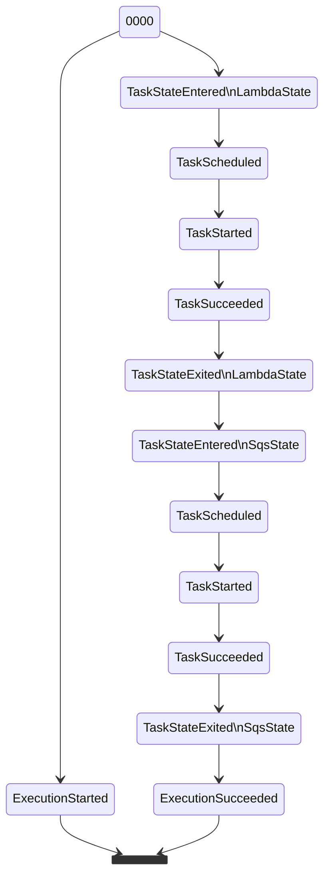

# HappyPath

```mermaid
stateDiagram-v2
state "ExecutionStarted" as 0001
0000 --> 0001
state "TaskStateEntered\nLambdaState" as 0002
0000 --> 0002
state "TaskScheduled" as 0003
0002 --> 0003
state "TaskStarted" as 0004
0003 --> 0004
state "TaskSucceeded" as 0005
0004 --> 0005
state "TaskStateExited\nLambdaState" as 0006
0005 --> 0006
state "TaskStateEntered\nSqsState" as 0007
0006 --> 0007
state "TaskScheduled" as 0008
0007 --> 0008
state "TaskStarted" as 0009
0008 --> 0009
state "TaskSucceeded" as 0010
0009 --> 0010
state "TaskStateExited\nSqsState" as 0011
0010 --> 0011
state "ExecutionSucceeded" as 0012
0011 --> 0012
state 0013 <<join>>
0001 --> 0013
0012 --> 0013
```