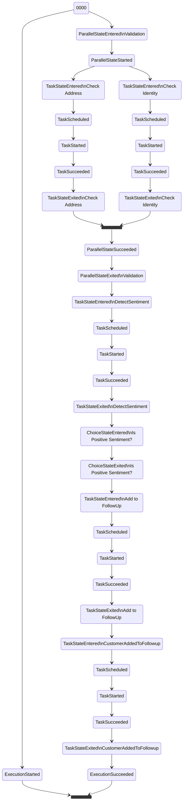

# HappyPathTest

```mermaid
stateDiagram-v2
state "ExecutionStarted" as 0001
0000 --> 0001
state "ParallelStateEntered\nValidation" as 0002
0000 --> 0002
state "ParallelStateStarted" as 0003
0002 --> 0003
state "TaskStateEntered\nCheck Address" as 0004
0003 --> 0004
state "TaskScheduled" as 0005
0004 --> 0005
state "TaskStarted" as 0006
0005 --> 0006
state "TaskSucceeded" as 0007
0006 --> 0007
state "TaskStateExited\nCheck Address" as 0008
0007 --> 0008
state "TaskStateEntered\nCheck Identity" as 0009
0003 --> 0009
state "TaskScheduled" as 0010
0009 --> 0010
state "TaskStarted" as 0011
0010 --> 0011
state "TaskSucceeded" as 0012
0011 --> 0012
state "TaskStateExited\nCheck Identity" as 0013
0012 --> 0013
state 0014 <<join>>
0008 --> 0014
0013 --> 0014
state "ParallelStateSucceeded" as 0015
0014 --> 0015
state "ParallelStateExited\nValidation" as 0016
0015 --> 0016
state "TaskStateEntered\nDetectSentiment" as 0017
0016 --> 0017
state "TaskScheduled" as 0018
0017 --> 0018
state "TaskStarted" as 0019
0018 --> 0019
state "TaskSucceeded" as 0020
0019 --> 0020
state "TaskStateExited\nDetectSentiment" as 0021
0020 --> 0021
state "ChoiceStateEntered\nIs Positive Sentiment?" as 0022
0021 --> 0022
state "ChoiceStateExited\nIs Positive Sentiment?" as 0023
0022 --> 0023
state "TaskStateEntered\nAdd to FollowUp" as 0024
0023 --> 0024
state "TaskScheduled" as 0025
0024 --> 0025
state "TaskStarted" as 0026
0025 --> 0026
state "TaskSucceeded" as 0027
0026 --> 0027
state "TaskStateExited\nAdd to FollowUp" as 0028
0027 --> 0028
state "TaskStateEntered\nCustomerAddedToFollowup" as 0029
0028 --> 0029
state "TaskScheduled" as 0030
0029 --> 0030
state "TaskStarted" as 0031
0030 --> 0031
state "TaskSucceeded" as 0032
0031 --> 0032
state "TaskStateExited\nCustomerAddedToFollowup" as 0033
0032 --> 0033
state "ExecutionSucceeded" as 0034
0033 --> 0034
state 0035 <<join>>
0001 --> 0035
0034 --> 0035
```